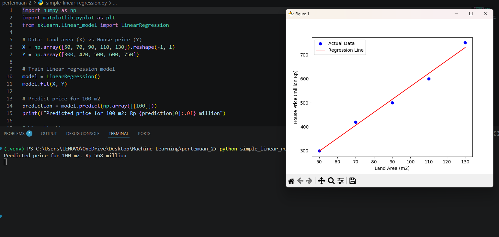
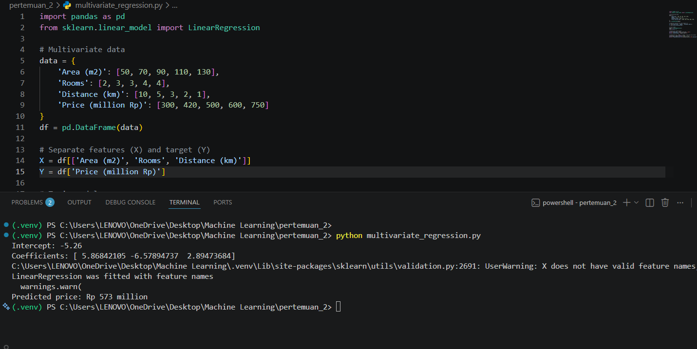
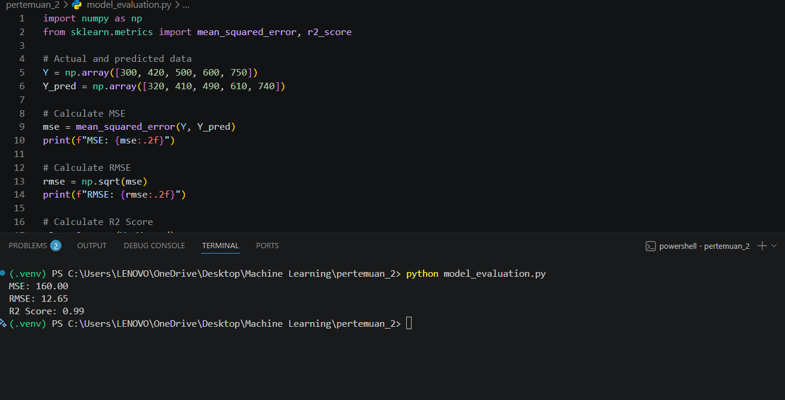
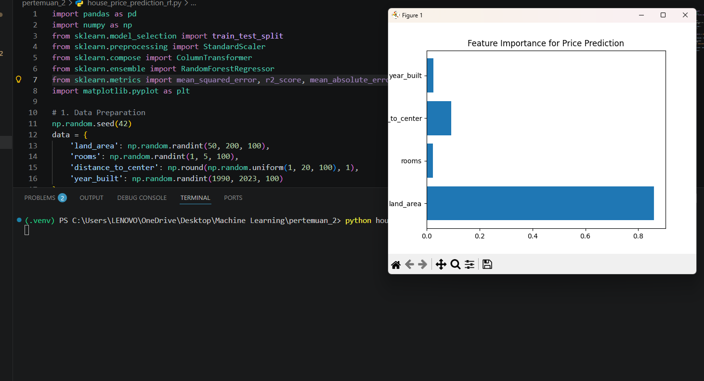
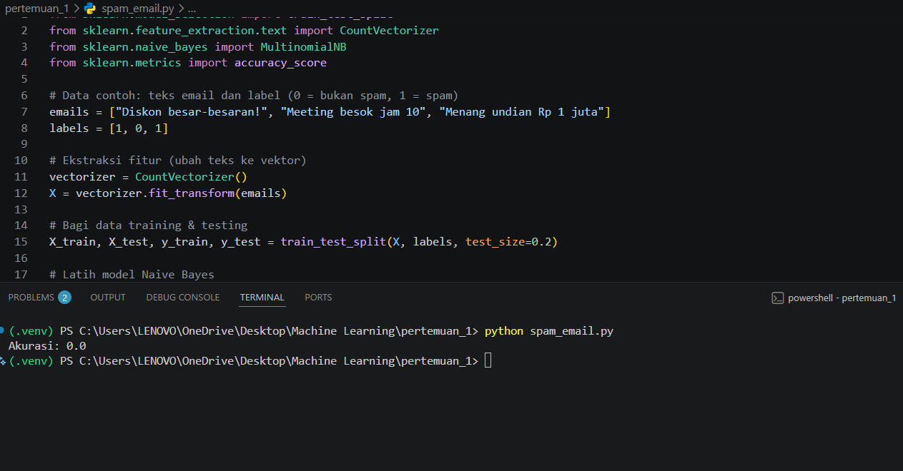
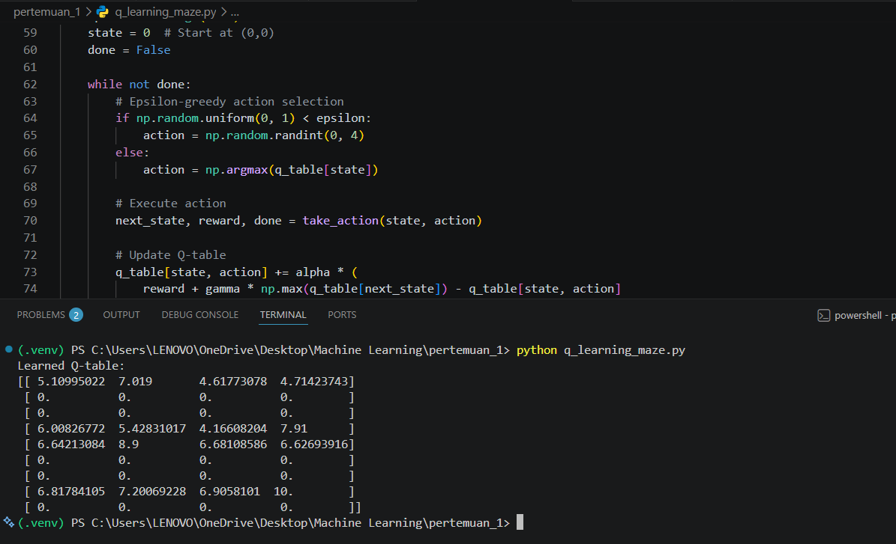
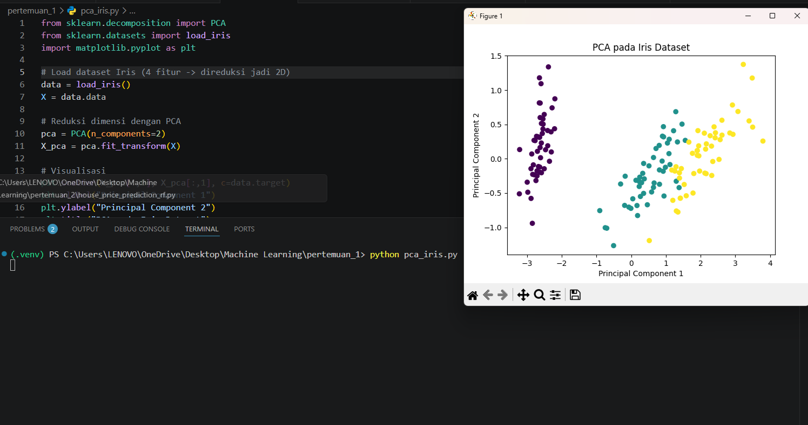
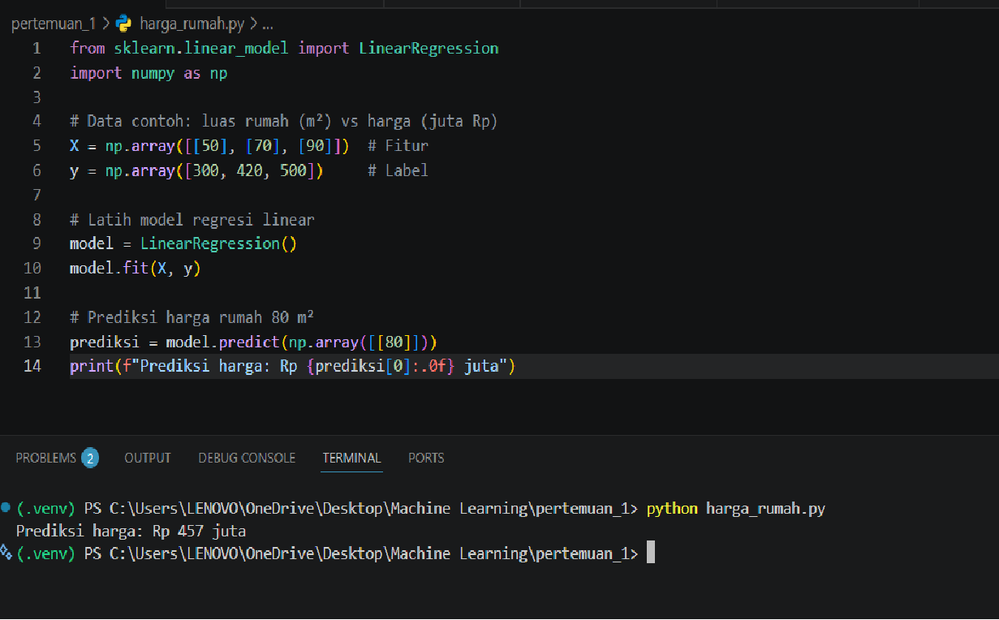
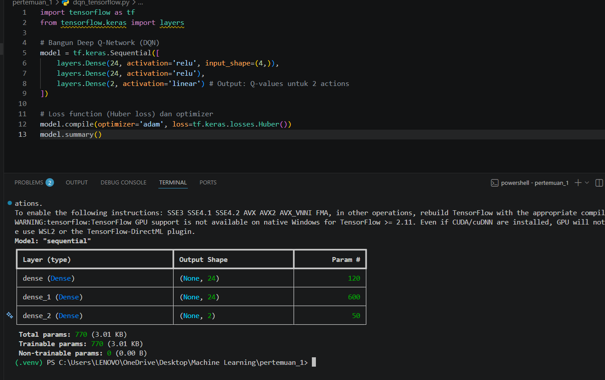
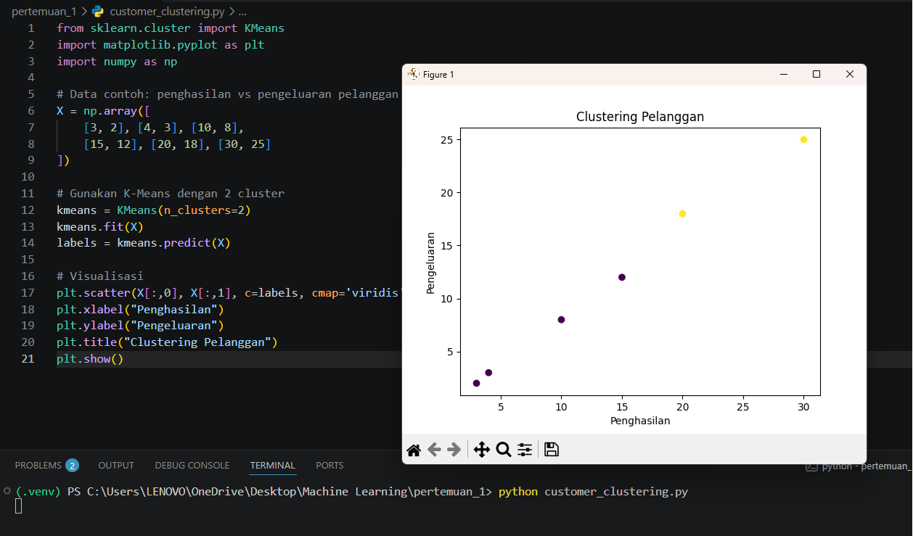

# 🚀 Machine Learning 

<p align="center">
  
  
  
</p>

---

## 📝 Deskripsi Proyek
Selamat datang di repositori **Machine Learning**! Proyek ini berisi kumpulan materi, latihan, dan implementasi algoritma Machine Learning yang disusun berdasarkan pertemuan kelas. Cocok untuk dokumentasi belajar maupun referensi proyek AI.

---

## 🛠️ Panduan Instalasi & Penggunaan

Ikuti langkah-langkah di bawah ini untuk menjalankan project di komputer lokal Anda:

Persiapan Awal
Lakukan kloning repositori ini ke direktori lokal:
```bash
git clone https://github.com/nvntiramadhani/Machine-Learning.git

cd Machine-Learning

pip3 install -r requirements.txt

# Contoh masuk ke pertemuan 1
cd pertemuan_1 atau cd pertemuan_2

# Menjalankan file utama
python3 nama_file.py
```
_ _ _

## 🖼️ Galeri Proyek

Berikut adalah visualisasi hasil dari berbagai model *Machine Learning* yang ada di repositori ini.

<table width="100%">
  <tr>
    <td align="center" width="33%">
      <b>Simple Linear Regression</b><br>
      
    </td>
    <td align="center" width="33%">
      <b>Multivariate Regression</b><br>
      
    </td>
    <td align="center" width="33%">
      <b>Model Evaluation Metrics</b><br>
      
    </td>
  </tr>
  <tr>
    <td align="center">
      <b>House Price Prediction (RF)</b><br>
      
    </td>
    <td align="center">
      <b>Spam Email Detection</b><br>
      
    </td>
    <td align="center">
      <b>Q-Learning Maze Solver</b><br>
      
    </td>
  </tr>
  <tr>
    <td align="center">
      <b>PCA on Iris Dataset</b><br>
      
    </td>
    <td align="center">
      <b>Prediksi Harga Rumah (Indo)</b><br>
      
    </td>
    <td align="center">
      <b>DQN with TensorFlow</b><br>
      
    </td>
  </tr>
  <tr>
    <td align="center">
      <b>Customer Clustering (Unsupervised)</b><br>
      
    </td>
    <td width="33%"></td> <td width="33%"></td> </tr>
</table>

<em>Tap foto untuk melihat penuh</em>

<p align="center">
Copyright © 2026 <b>Novianti Cantik</b>. All rights reserved.
</p>
